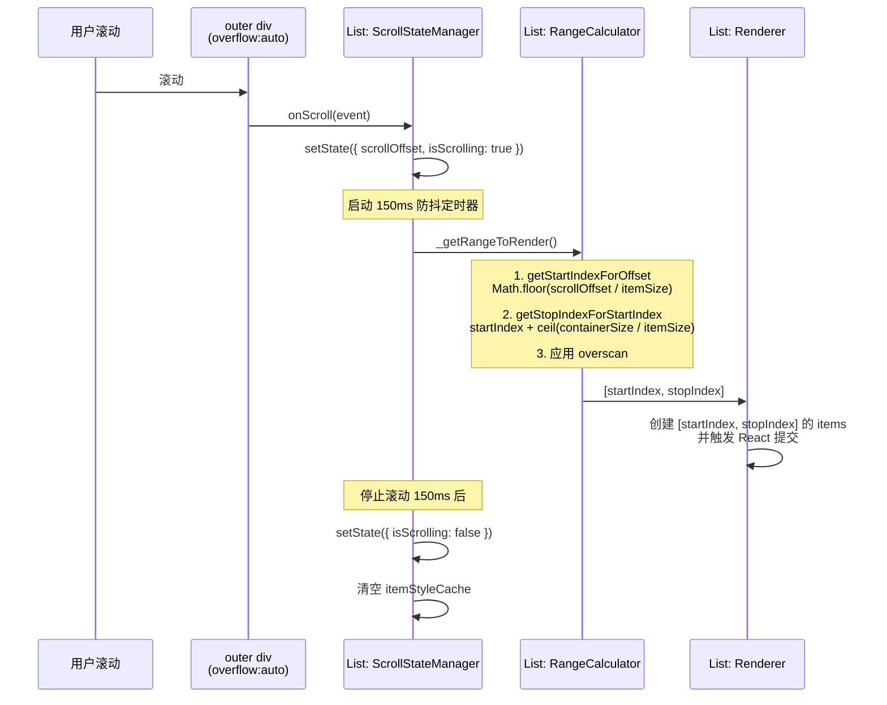

# react-window FixedSizeList 源码阅读总结

---

## 1. 项目概述

### 核心能力

FixedSizeList 是一个固定高度虚拟列表组件，核心能力只有一项：**在仅渲染可见 DOM 节点的前提下，提供与渲染全部节点一致的原生滚动体验**。

<details>
<summary>点击展开完整示例代码</summary>

```tsx
import { FixedSizeList as List } from "react-window";

interface ItemData {
  id: number;
  title: string;
  description: string;
}

const items: ItemData[] = Array.from({ length: 10000 }, (_, i) => ({
  id: i + 1,
  title: `Item ${i + 1}`,
  description: "A description for the item",
}));

const Row = ({
  index,
  style,
  data,
}: {
  index: number;
  style: React.CSSProperties;
  data: ItemData[];
}) => {
  const item = data[index];
  return (
    <div style={style}>
      #{item.id} {item.title} — {item.description}
    </div>
  );
};

<List
  height={500}
  itemCount={items.length}
  itemSize={60}
  width="100%"
  itemData={items}
>
  {Row}
</List>;
```

</details>

---

## 2. 核心原理 & 关键源码解析

监听容器滚动 -> 修改state: scrollOffset -> React执行render方法 -> 计算需要被渲染的`items` -> 浏览器渲染

### 完整流程



### 关键源码：滚动处理

```javascript
#onScrollVertical = (event: ScrollEvent): void => {
  const { clientHeight, scrollHeight, scrollTop } = event.currentTarget;
  this.setState(prevState => {
    if (prevState.scrollOffset === scrollTop) {
      // Scroll position may have been updated by cDM/cDU,
      // In which case we don't need to trigger another render,
      // And we don't want to update state.isScrolling.
      return null;
    }

    // Prevent Safari's elastic scrolling from causing visual shaking when scrolling past bounds.
    const scrollOffset = Math.max(
      0,
      Math.min(scrollTop, scrollHeight - clientHeight)
    );

    return {
      isScrolling: true,
      scrollDirection:
        prevState.scrollOffset < scrollOffset ? 'forward' : 'backward',
      scrollOffset,
      scrollUpdateWasRequested: false,
    };
  }, this.#resetIsScrollingDebounced);
};
```

**设计要点：**

- `scrollOffset === prevState.scrollOffset` 时返回 null，跳过不必要的 render
- `Math.max(0, Math.min(...))` 限制 Safari 弹性滚动导致的越界值
- `_resetIsScrollingDebounced` 作为回调，在 setState 提交后重置 isScrolling

### 关键源码：范围计算

```javascript
_getRangeToRender(): [number, number, number, number] {
  const { itemCount, overscanCount } = this.props;
  const { isScrolling, scrollDirection, scrollOffset } = this.state;

  if (itemCount === 0) {
    return [0, 0, 0, 0];
  }

  const startIndex = getStartIndexForOffset(
    this.props,
    scrollOffset,
    this.#instanceProps
  );
  const stopIndex = getStopIndexForStartIndex(
    this.props,
    startIndex,
    scrollOffset,
    this.#instanceProps
  );

  // Overscan by one item in each direction so that tab/focus works.
  // If there isn't at least one extra item, tab loops back around.
  const overscanBackward =
    !isScrolling || scrollDirection === 'backward'
      ? Math.max(1, overscanCount)
      : 1;
  const overscanForward =
    !isScrolling || scrollDirection === 'forward'
      ? Math.max(1, overscanCount)
      : 1;

  return [
    Math.max(0, startIndex - overscanBackward),
    Math.max(0, Math.min(itemCount - 1, stopIndex + overscanForward)),
    startIndex,
    stopIndex,
  ];
}
```

**设计要点：**

- 快速滚动时只给滚动方向的 item 做 overscan，反方向的只保留 1 个（减少渲染）
- 停止滚动时双向都用 overscanCount（保证 Tab/Focus 不跳出列表）
- 返回 4 个值：实际渲染的起止 + 精确可见的起止，供 `onItemsRendered` 回调使用

### 关键源码：渲染

```javascript
render() {
  const [startIndex, stopIndex] = this._getRangeToRender();
  const items = [];
  if (itemCount > 0) {
    for (let index = startIndex; index <= stopIndex; index++) {
      items.push(createElement(children, {
        data: itemData,
        key: itemKey(index, itemData),
        index,
        isScrolling: useIsScrolling ? isScrolling : undefined,
        style: this._getItemStyle(index),  // position:absolute + top: offset
      }));
    }
  }
  return createElement('div', { /* outer: overflow:auto */ },
    createElement('div', { /* inner: height: totalSize */ }, items)
  );
}
```

**设计要点：**

- 两层 DOM 结构：**outer** 负责滚动容器，**inner** 负责撑起滚动高度
- `_getItemStyle` 用 `memoizeOne` 缓存 style，避免同 index 重复计算
- `isScrolling` 为 true 时，inner 容器设 `pointerEvents: none` 提升滚动性能

---

## 3. 核心亮点、设计决策 & 可复用经验

### 工厂函数分离变与不变

所有变体（FixedSizeList / VariableSizeList）共享同一个工厂函数，差异点被收敛为 6 个纯函数传入：

```javascript
createListComponent({
  getItemOffset, // item 距离顶部的偏移
  getItemSize, // item 的高度
  getEstimatedTotalSize, // 总滚动高度
  getOffsetForIndexAndAlignment, // scrollToItem 的目标位置
  getStartIndexForOffset, // scrollOffset → 起始 index
  getStopIndexForStartIndex, // 起始 index → 终止 index
});
```

**可复用经验：** 当两个组件"行为框架相同，只有局部计算逻辑不同"时，用工厂函数（或策略模式）比继承或 HOC 更清晰——差异是显式的、类型化的。
